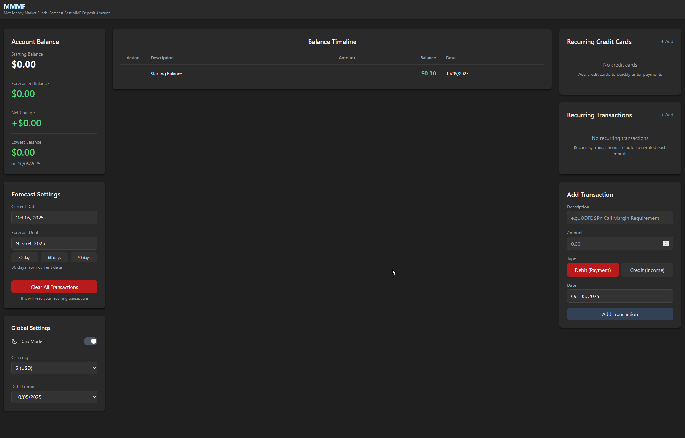
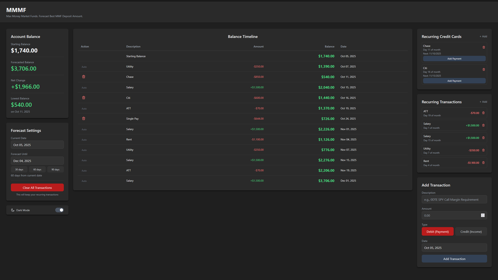
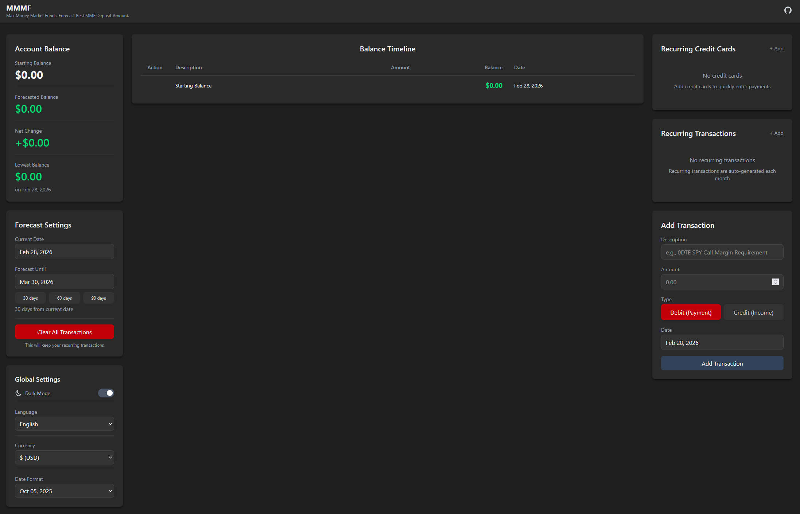

[](https://github.com/jasonyang-ee/MMMF/actions/workflows/release.yml)
[](https://github.com/jasonyang-ee/MMMF/actions/workflows/check.yml)

<h1 align="center">MMMF</h1>
<h3 align="center">Max Money Market Funds</h3>
<h4 align="center">A Forecasting Application Predicting Account Balance by Date for Best Money Market Funds Deposit Amount</h4>
<p align="center"></p>

## Features

- **Balance Forecasting**: Visualize your account balance for future dates
- **Future Date Based Transactions**: Add income and expenses with specific dates
- **Starting Balance**: Click to set and adjust your initial account balance
- **Lowest Balance Tracking**: Monitor the lowest balance and its date
- **Recurring Transactions**: Reuse repeating transactions
- **Persistent Storage**: Simple file based json data storage
- **Edit on Click**: Click on recurring transaction items to edit
- **Clear Calculations**: Remove all transactions while keeping recurring items
- **Global Currency and Date Format**: Search by currency code, localized name, or symbol; currency-specific decimals and localized dates
- **Searchable Language Selection**: Search native or English names; keyboard navigation, bounded lists, and Arabic right-to-left layout
- **Internationalization (i18n)**: Support for multiple languages with 20 complete catalogs, including English, Español, 日本語, 繁體中文, العربية, हिन्दी, and more
  > Contributions and native-language reviews are welcome. See `SPEC.md` for the language registry and expansion checklist.

## Demo

### Demo Website: https://mmmf-demo.jasony.org



## Deployment (Docker)

### Web Interface

- Access the web interface at `http://<host_ip>:5173`

### Data Persistence

- Bind mounts to preserve data: `/app/data/`

### Docker Compose Configuration

```yaml
services:
  mmmf:
    image: jasonyangee/mmmf:latest
    container_name: mmmf
    restart: unless-stopped
    ports:
      - "5173:5173"
    volumes:
      - ./mmmf/data:/app/data
    environment:
      TZ: America/Los_Angeles
      DEFAULT_LANGUAGE: en # supported values: see shared/preferences.js
```

### Docker Image

- [Docker Hub](https://hub.docker.com/r/jasonyangee/mmmf)

  ```
  jasonyangee/mmmf:latest
  ```

- [GitHub Container Registry](https://github.com/jasonyang-ee/mmmf/pkgs/container/mmmf)

  ```
  ghcr.io/jasonyang-ee/mmmf:latest
  ```

### Supported Platforms

- Linux AMD64
- Linux ARM64

## Deployment (Cloudflare Workers)

#### Deploy via Cloudflare Dashboard (GitHub Integration)

**Fill in the Cloudflare Workers setup page as follows:**

1. Fork this repository to your GitHub account.
2. Create a `MMMF_KV` [KV namespace](https://developers.cloudflare.com/kv/) (under **Storage & Databases** -> **KV**), and copy the namespace ID.
3. Update the `kv_namespaces` ID in `wrangler.jsonc` (Workers) or `wrangler.pages.jsonc` (Pages) with your own namespace ID, then commit and push the change to your forked repository.
4. Configure the [GitHub integration for cloudflare application](https://github.com/apps/cloudflare-workers-and-pages/installations/new) to connect your forked repository.
5. Create a project in [Cloudflare Workers](https://developers.cloudflare.com/workers/).
   1. Select **Continue with GitHub** as the deployment method.
   2. Select your forked repository.
   3. Make a project name.
   4. **Build command**: `npm run build`
   5. **Deploy command**: `npx wrangler deploy`

## Deployment (Cloudflare Pages)

1. Fork this repository to your GitHub account.
2. Create a [KV namespace](https://developers.cloudflare.com/kv/) (under **Storage & Databases** -> **KV**), and copy the namespace ID.
3. Update the `kv_namespaces` ID in `wrangler.jsonc` (Workers) or `wrangler.pages.jsonc` (Pages) with your own namespace ID, then commit and push the change to your forked repository.
4. Configure the [GitHub integration for cloudflare application](https://github.com/apps/cloudflare-workers-and-pages/installations/new) to connect your forked repository.
5. Create a project in [Cloudflare Workers](https://developers.cloudflare.com/workers/).
6. Force Pages deployment by clicking the footnote: `Looking to deploy Pages? Get started`
   1. Select **Import an existing Git repository** as the deployment method.
   2. Select your forked repository.
   3. Make a project name.
   4. Select **Framework preset**: React (Vite)
   5. **Build command**: `npm run build`
   6. **Build output directory**: `client/dist`

7. Force update KV binding in **Settings** -> **Bindings** -> **Add** -> **KV Namespace**.
   1. Variable name: `MMMF_KV`
   2. Namespace: Select the namespace created in step 2.

8. **(Optional)** Enable Demo Mode for public demos:
   1. Go to **Settings** -> **Environment Variables**
   2. Add variable: `DEMO` with value `true`
   3. This enables session-based data isolation where each user gets their own data
   4. Session data automatically expires after 5 days

9. Deploy the project again. Pages functions live in the root `functions/` directory. For CLI deployment, use `npx wrangler pages deploy --config wrangler.pages.jsonc`; Workers uses `npx wrangler deploy`.

### Storage and access

Normal mode is one shared account with no built-in login. Protect a private deployment with authentication at your reverse proxy or Cloudflare Access. `DEMO=true` isolates disposable sessions on both Express and Cloudflare; sessions expire after five days.

Express uses atomic, serialized file updates within one server process. Do not run multiple writers against the same data directory. Cloudflare KV is eventually consistent and limits writes to the same key; simultaneous writes from different Worker instances can overwrite each other. Use it with that limitation in mind; stronger transactional storage requires a separate design change.

`ALLOWED_ORIGIN` permits one exact cross-origin API origin when needed. Same-origin access works without it. Express supports `DATA_DIR` to override the default storage directory. Currency changes affect formatting and input precision, without converting stored amounts.

### Reverse proxies (Express and Docker)

`TRUST_PROXY` is disabled when unset or blank. To recognize HTTPS and client IPs behind a reverse proxy, set it to a comma-separated list of only your actual trusted proxy IP addresses or CIDRs. IPv4 and IPv6 literals are accepted; CIDR prefixes must be decimal numbers from 1–32 for IPv4 or 1–128 for IPv6. Whitespace around entries is allowed. Empty entries, invalid addresses, `true`/`false`, hop counts, subnet aliases such as `loopback`, wildcards and `/0` are rejected at startup.

For example, add this under your Compose service's `environment`, replacing the documentation addresses with your proxy peers before uncommenting it:

```yaml
# TRUST_PROXY: "192.0.2.10/32,2001:db8::10/128" # replace with actual proxy IPs
```

The trusted proxy must overwrite client-supplied `X-Forwarded-For` and `X-Forwarded-Proto` headers with the verified client address/chain and original protocol. Also overwrite `X-Forwarded-Host` if sent. Preserve the public `Host` header for same-origin API requests, or configure the exact public origin in `ALLOWED_ORIGIN`. Restrict backend access to the trusted network/proxy and keep authentication at that boundary; proxy trust is not authentication.

With a matching proxy configuration, HTTPS demo sessions receive Secure cookies and clients receive separate API/static rate-limit quotas. The nearest untrusted address in the forwarding chain identifies the client; untrusted peers cannot change identity or protocol through forwarded headers. Direct loopback health checks bypass only the static limiter. This setting applies only to Express/Docker: Cloudflare keeps its runtime protocol and client-IP handling, with per-isolate API limits and separate edge configuration for distributed limits.

## Local Development

Requires Node.js 24 or newer.

- Linux

  ```bash
  ./start.sh
  ```

- Docker Compose
  ```bash
  docker-compose up -d --build
  ```

## Screenshots

> Populated View



> Empty View



## Verification

```bash
npm ci
npm test
npm run build
npm run build:worker  # local dry-run; does not deploy
npm run build:pages   # local Pages Functions bundle
npx playwright install chromium
npm run test:ui
bash -n start.sh release.sh
shellcheck start.sh release.sh
npm audit
```

Browser tests start a disposable demo server and use temporary data. An existing Chromium executable can be selected with `PLAYWRIGHT_CHROMIUM_EXECUTABLE`. No JavaScript lint script is configured. CI runs Node tests and build checks; browser checks should accompany UI changes.

`SPEC.md` documents architecture, API/data shapes, forecast rules, UI contracts, localization and operational limits. `REVIEW.md` records the repository review and its verification evidence.
