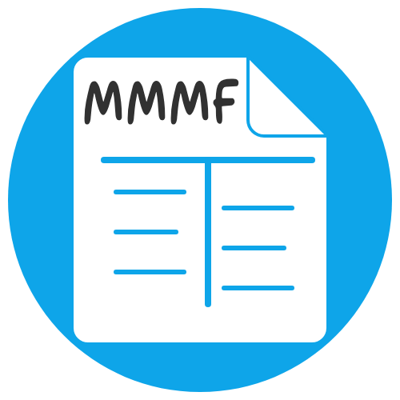
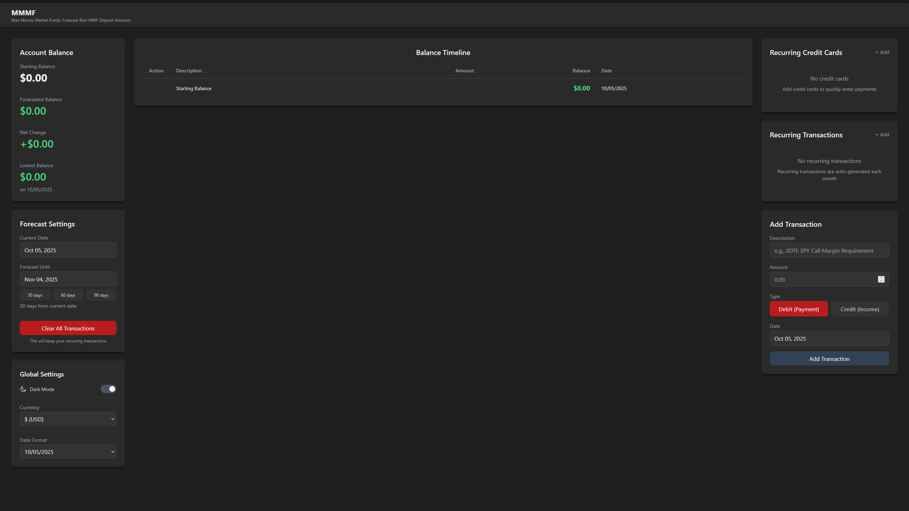

[](https://github.com/jasonyang-ee/MMMF/actions/workflows/publish.yml)
[](https://github.com/jasonyang-ee/MMMF/actions/workflows/testing.yml)

<h1 align="center">MMMF</h1>
<h3 align="center">Max Money Market Funds</h3>
<h4 align="center">A Forecasting Application Predicting Account Balance by Date for Best Money Market Funds Deposit Amount</h4>
<p align="center"></p>

## Features

- **Balance Forecasting**: Visualize your account balance for future dates
- **Future Date Based Transactions**: Add income and expenses with specific dates
- **Starting Balance**: Click to set and adjust your initial account balance
- **Lowest Balance Tracking**: Monitor the lowest balance and its date
- **Recurring Transactions**: Reuse repeating transactions
- **Persistent Storage**: Simple file based json data storage
- **Edit on Click**: Click on recurring transaction items to edit
- **Clear Calculations**: Remove all transactions while keeping recurring items
- **Global Currency and Date Format**: Set your preferred currency and date format
- **Internationalization (i18n)**: Support for multiple languages including English, Español, 日本語, and 繁體中文
  > Looking for contributors to help translate to more languages!

## Getting Started

### Web Interface

- Access the web interface at `http://<host_ip>:5173`

### Demo


### Run Using Docker Compose

```yaml
services:
  mmmf:
    image: jasonyangee/mmmf:latest
    container_name: mmmf
    restart: unless-stopped
    ports:
      - "5173:5173"
    volumes:
      - ./mmmf/data:/app/data
    environment:
      TZ: America/Los_Angeles
      DEFAULT_LANGUAGE: en # supported lanugage values: en, zht, ja, es
```

### Docker Image

- [Docker Hub](https://hub.docker.com/r/jasonyangee/mmmf)

  ```
  jasonyangee/mmmf:latest
  ```

- [GitHub Container Registry](https://github.com/jasonyang-ee/mmmf/pkgs/container/mmmf)

  ```
  ghcr.io/jasonyang-ee/mmmf:latest
  ```

### Supported Platforms

- Linux AMD64
- Linux ARM64
- Linux ARMv7

### Data Persistence

- Bind mounts to preserve data: `/app/data/`

## Screenshots

- Populated View
  

- Empty View
- 

## Local Development

### Run Locally

- Linux

  ```bash
  ./start.sh
  ```

- Windows

  ```powerhell
  start.bat
  ```

- Docker Compose
  ```bash
  docker-compose up -d --build
  ```

### Manual (Node) Development

1. Install dependencies
   ```bash
   npm install
   ```
2. Start dev servers (API + Vite)
   ```bash
   npm run dev
   ```
3. Open the app at `http://localhost:5173` (API at `http://localhost:3600`).

### Internationalization (i18n)

- Use the language toggle in the header to switch between English and Español.
- The selected language persists in settings.

### Currency

- Configure currency under Global Settings.
- Support added for Guatemalan Quetzal: `GTQ` (symbol `Q`).
