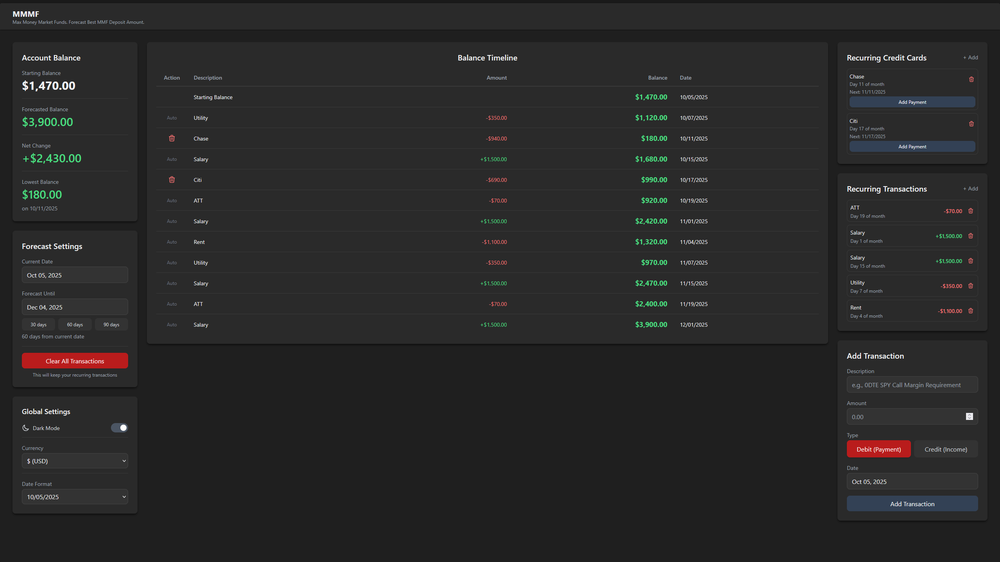

[](https://github.com/jasonyang-ee/MMMF/actions/workflows/publish.yml)
[](https://github.com/jasonyang-ee/MMMF/actions/workflows/testing.yml)

<h1 align="center">MMMF</h1>
<h3 align="center">Max Money Market Funds</h3>
<h4 align="center">A Forecasting Application Predicting Account Balance by Date for Best Money Market Funds Deposit Amount</h4>
<p align="center"></p>

## Features

- **Balance Forecasting**: Visualize your account balance for future dates
- **Future Date Based Transactions**: Add income and expenses with specific dates
- **Starting Balance**: Click to set and adjust your initial account balance
- **Lowest Balance Tracking**: Monitor the lowest balance and its date
- **Recurring Transactions**: Reuse repeating transactions
- **Persistent Storage**: Simple file based json data storage
- **Edit on Click**: Click on recurring transaction items to edit
- **Clear Calculations**: Remove all transactions while keeping recurring items
- **Global Currency and Date Format**: Set your preferred currency and date format
- **Internationalization (i18n)**: Support for multiple languages including English, Español, 日本語, and 繁體中文
  > Looking for contributors to help translate to more languages!

## Demo

### Demo Website: https://mmmf-demo.jasony.org


## Deployment (Docker)

### Web Interface

- Access the web interface at `http://<host_ip>:5173`

### Data Persistence

- Bind mounts to preserve data: `/app/data/`

### Docker Compose Configuration

```yaml
services:
  mmmf:
    image: jasonyangee/mmmf:latest
    container_name: mmmf
    restart: unless-stopped
    ports:
      - "5173:5173"
    volumes:
      - ./mmmf/data:/app/data
    environment:
      TZ: America/Los_Angeles
      DEFAULT_LANGUAGE: en # supported lanugage values: en, zht, ja, es
```

### Docker Image

- [Docker Hub](https://hub.docker.com/r/jasonyangee/mmmf)

  ```
  jasonyangee/mmmf:latest
  ```

- [GitHub Container Registry](https://github.com/jasonyang-ee/mmmf/pkgs/container/mmmf)

  ```
  ghcr.io/jasonyang-ee/mmmf:latest
  ```

### Supported Platforms

- Linux AMD64
- Linux ARM64
- Linux ARMv7

## Deployment (Cloudflare Workers)

#### Deploy via Cloudflare Dashboard (GitHub Integration)

**Fill in the Cloudflare Workers setup page as follows:**

1. Fork this repository to your GitHub account.
2. Create a `MMMF_KV` [KV namespace](https://developers.cloudflare.com/kv/) (under **Storage & Databases** -> **KV**), and copy the namespace ID.
3. Update the `kv_namespaces` ID in `wrangler.jsonc` with your own namespace ID, then commit and push the change to your forked repository.
4. Configure the [GitHub integration for cloudflare application](https://github.com/apps/cloudflare-workers-and-pages/installations/new) to connect your forked repository.
5. Create a project in [Cloudflare Workers](https://developers.cloudflare.com/workers/).

   1. Select **Continue with GitHub** as the deployment method.
   2. Select your forked repository.
   3. Make a project name.
   4. **Build command**: `npm run build`
   5. **Deploy command**: `npx wrangler deploy`

## Deployment (Cloudflare Pages)

1. Fork this repository to your GitHub account.
2. Create a [KV namespace](https://developers.cloudflare.com/kv/) (under **Storage & Databases** -> **KV**), and copy the namespace ID.
3. Update the `kv_namespaces` ID in `wrangler.jsonc` with your own namespace ID, then commit and push the change to your forked repository.
4. Configure the [GitHub integration for cloudflare application](https://github.com/apps/cloudflare-workers-and-pages/installations/new) to connect your forked repository.
5. Create a project in [Cloudflare Workers](https://developers.cloudflare.com/workers/).
6. Force Pages deployment by clicking the footnote: `Looking to deploy Pages? Get started`

   1. Select **Import an existing Git repository** as the deployment method.
   2. Select your forked repository.
   3. Make a project name.
   4. Select **Framework preset**: React (Vite)
   5. **Build command**: `npm run build`
   6. **Build output directory**: `dist`

7. Force update KV binding in **Settings** -> **Bindings** -> **Add** -> **KV Namespace**.

   1. Variable name: `MMMF_KV`
   2. Namespace: Select the namespace created in step 2.

8. **(Optional)** Enable Demo Mode for public demos:

   1. Go to **Settings** -> **Environment Variables**
   2. Add variable: `DEMO` with value `true`
   3. This enables session-based data isolation where each user gets their own data
   4. Session data automatically expires after 5 days

9. Deploy the project again.

## Local Development

- Linux

  ```bash
  ./start.sh
  ```

- Windows

  ```powerhell
  start.bat
  ```

- Docker Compose
  ```bash
  docker-compose up -d --build
  ```

## Screenshots

> Populated View



> Empty View


